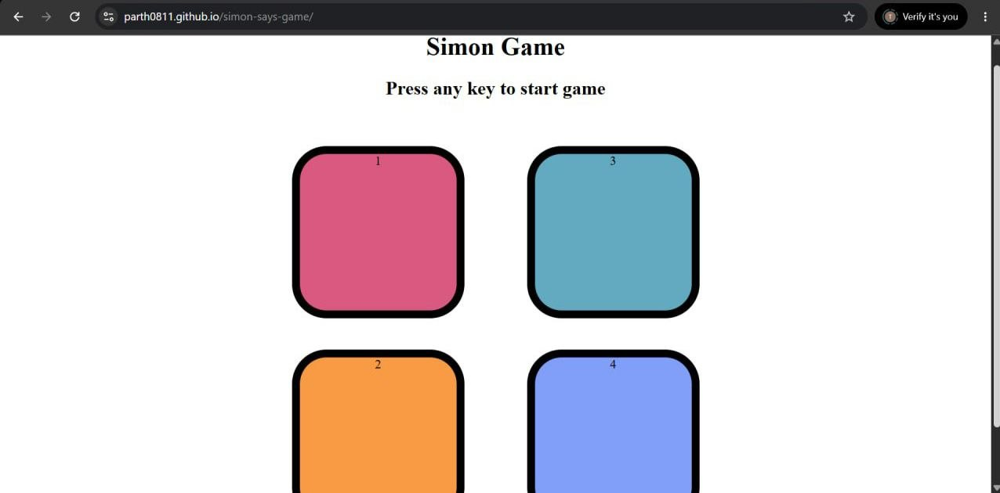

# 🎮 Simon Says Game

A fun and interactive **Simon Says Game** built using **HTML, CSS, and JavaScript**. The game challenges players to memorize and repeat an increasingly long sequence of colors. As the levels increase, the sequence becomes more difficult, testing the player's memory and concentration.

---

## 🚀 Features

* Classic Simon Says gameplay
* Random color sequence generation
* Level progression system
* Visual button animations
* Game Over detection
* Score display
* Restart game with a key press

---

## 📂 Project Structure

```bash
Simon-Says-Game/
│
├── index.html
├── index.css
└── index.js
```

---

## 🛠️ Technologies Used

* HTML5
* CSS3
* JavaScript (ES6)

---

## 🎮 How to Play

1. Open the game in your browser.
2. Press any key to start.
3. Watch the color that flashes.
4. Click the corresponding colored button.
5. Repeat the entire sequence correctly.
6. With each level, a new color is added to the sequence.
7. The game ends when you click the wrong color.

---

## 🧠 Game Logic

### Sequence Generation

At every level:

```javascript
let randIdx = Math.floor(Math.random() * 4);
let randColor = btns[randIdx];
gameSeq.push(randColor);
```

A random color is selected and added to the game sequence.

### User Input Validation

```javascript
if (userSeq[idx] === gameSeq[idx]) {
    // Continue game
}
```

The player's input is checked against the generated sequence.

### Game Over

If the player clicks the wrong button:

```javascript
Game Over! Your score was X
```

The screen flashes red and the game resets.

---

## 📸 Screenshots




---

## ⚙️ Installation

Clone the repository:

```bash
git clone https://github.com/parth0811/simon-says-game.git
```

Navigate to the project folder:

```bash
cd simon-says-game
```

Open the project:

```bash
index.html
```

Or use VS Code Live Server.

---

## 📚 Concepts Practiced

* DOM Manipulation
* Event Listeners
* Arrays
* Functions
* Timers (`setTimeout`)
* Conditional Logic
* Game State Management

---

## 🔮 Future Improvements

* Sound effects for each color
* Mobile support
* High score tracking using Local Storage
* Difficulty levels
* Dark mode
* Start and Restart buttons
* Leaderboard system

---

## 👨‍💻 Author

**Parth Girdhar**

* MERN Stack Developer
* Frontend & JavaScript Enthusiast

LinkedIn:
https://www.linkedin.com/in/parth-girdhar0811/

---

## 📜 License

This project is open-source and available under the MIT License.
